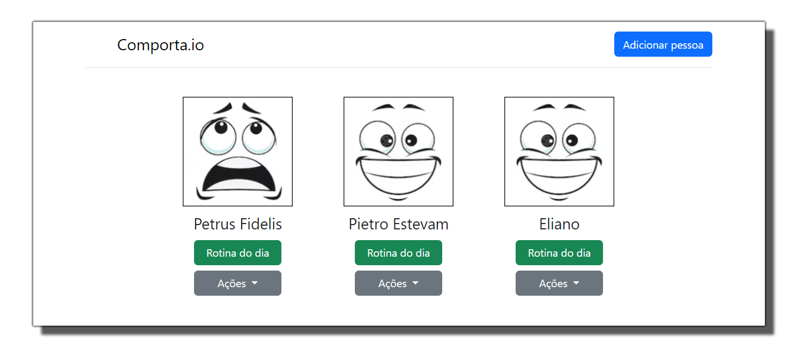

<p align="center" style="margin: 40px 0">
    Comporta.io
</p>

<div align="center">


</div>

# Comporta.io - Front-end

Monitoramento e identificação de alterações de comportamento.

**Comporta.io** tem como objetivo resolver a dor de pessoas dentro do espectro autista nível 2 e 3. Essa dor está relacionada a identificação de possíveis mudanças de comportamentos.

Software foi desenvolvido para o MVP da Sprint 1 da pós graduação de Engenharia de Software PUC-Rio.
Apresentação em: https://youtu.be/6cihGNLlNhE

> ⚠️ Para o funcionamento dessa aplicação, é necessária a execução da API. Você pode acessar o repositório da API [clicando aqui](https://github.com/elianoestevampuc/comporta.io-backend.git).

## Pré-visualização

<p align="center" style="margin: 40px 0">
    
</p>

## Executando a Aplicação


### 1 - Clonando o repositório
Para clonar o projeto execute seguinte comando:

```
git clone https://github.com/elianoestevampuc/comporta.io-frontend.git
```

### 2 - Executando a Aplicação
Para executar o front-end, execute a API e basta abrir o arquivo index.html no seu browser.

